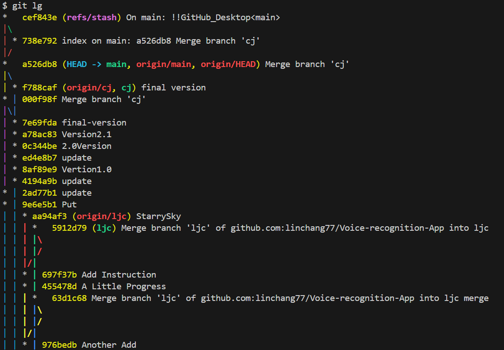
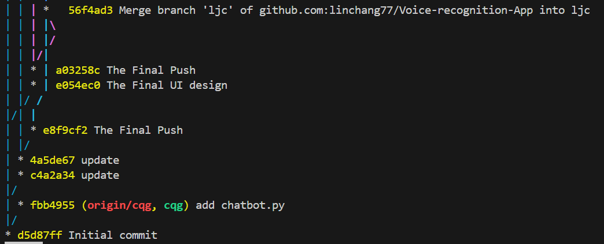

# 文心一言聊天机器人

## 安装与使用说明

### 安装步骤

这个项目包括聊天机器人和语音生成服务器部分，建议用VScode打开

#### 安装聊天机器人

请确保你的电脑上下载了python3.9-3.11(安装时注意选中Add Python to environment variables)，以及git和anaconda

git下载网址：<https://github.com/git-for-windows/git/releases/download/v2.45.1.windows.1/Git-2.45.1-64-bit.exe>

1. **克隆仓库**
   在桌面打开`git bash`

   ```bash
   git clone https://github.com/linchang77/Voice-recognition-App
   cd chatbot
   ```

2. **安装依赖**

   1. 创建conda虚拟环境，执行命令 `conda create --name VoiceAssistant python=3.10`
   2. 激活 Conda 环境, 执行命令`conda activate VoiceAssistant`
   3. 安装依赖,执行 `pip install -r requirements.txt`

3. **配置 API 密钥**
   在代码中自带了一个API密钥，你也可以自己到文心一言官网上获取密钥。

#### 安装语音合成服务器

1. 下载并安装git，<https://github.com/git-for-windows/git/releases/download/v2.45.1.windows.1/Git-2.45.1-64-bit.exe>
2. 创建空文件夹 `D:/chattts` 并进入，打开gitbash输入： `git clone https://github.com/jianchang512/chatTTS-ui .`以及`cd chatTTS-ui`
3. 激活之前创建的虚拟环境，执行 `conda activate VoiceAssistant`
4. 安装依赖,执行 `pip install -r requirements.txt`
5. 如果不需要CUDA加速，执行 `pip install torch==2.2.0 torchaudio==2.2.0`

如果需要CUDA加速，执行 `pip install torch==2.2.0 torchaudio==2.2.0 --index-url https://download.pytorch.org/whl/cu118`

另需安装 CUDA11.8+ ToolKit，请自行搜索安装方法或参考 <https://juejin.cn/post/7318704408727519270>
8. 执行 `python app.py` 启动，将自动打开浏览器窗口，默认地址 `http://127.0.0.1:9966`  (注意：默认从 modelscope 魔塔下载模型，不可使用代理下载，请关闭代理)

### 使用步骤

1. **启动语音合成服务器**
   打开cmd或ide激活刚刚配置好的环境然后执行`python app.py`

2. **启动聊天机器人程序**
   打开cmd或ide激活刚刚配置好的环境然后执行`python asr.py`

## git提交记录




该项目具有良好的版本控制,三位组员各自拥有自己的分支,共享一个main分支。
